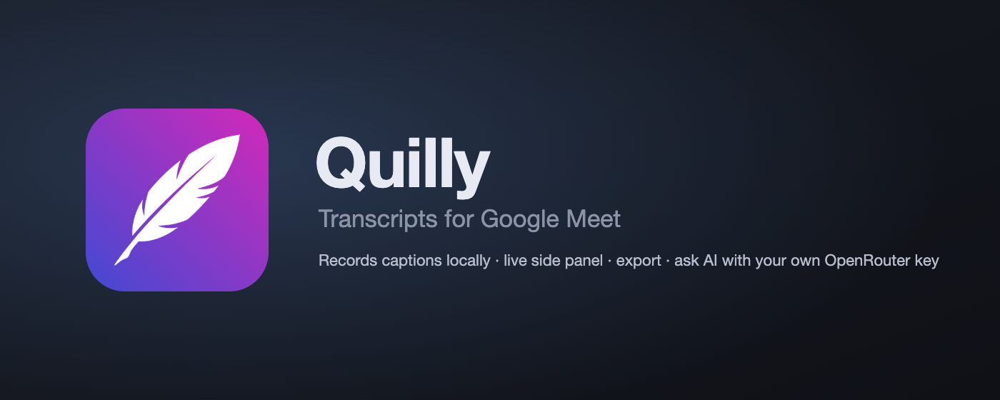

<p align="center">
  
</p>

<p align="center">
  <a href="https://github.com/gegham-khachatryan/quilly/actions/workflows/ci.yml"></a>
  <a href="LICENSE"></a>
  <a href="https://github.com/gegham-khachatryan/quilly/releases"></a>
  <a href="https://gegham-khachatryan.github.io/quilly/privacy"></a>
</p>

**Quilly turns Google Meet's captions into a transcript you own.** It switches on Meet's native
captions when you join a call, records every line with the speaker's name and a timestamp, keeps
going while you work in other tabs, and lets you export the result or ask an AI model about it with
your own OpenRouter key. Everything stays in your browser.

## Highlights

- **Live, wherever you are.** The side panel streams the transcript as people speak and follows the active recording across tabs. Hand raises and emoji reactions are logged alongside what was said.
- **Ask AI.** Summary, action items, decisions, a follow-up email, or any question about the meeting. Streaming answers, Markdown rendering, chats saved per session.
- **Every meeting, searchable.** Sessions with search, speaker filter, rename and delete. Export as `.txt`, `.md`, `.json` or copy to the clipboard.
- **Your key, any model.** The picker searches OpenRouter's live catalogue with provider, price and context length. No Quilly account, no server.

### In detail

- **Auto-start.** Joining a call starts a recording and turns captions on. Captions Quilly switched on are switched off again when it stops. Auto-start can be disabled; `Alt+Shift+R` toggles recording by hand.
- **Invisible captions.** The caption overlay is hidden by default while recording, and the space it would take is given back to the video grid. Meet's captions button and the `c` key show or hide it instead of cutting the transcript source.
- **Background tabs.** Meet stops rendering captions in a hidden tab. A small main-world shim keeps them flowing while a recording is active and is inert otherwise.
- **Hand raises and reactions** are recorded as events in the transcript, exported with it and visible to the AI.
- **Private by design.** Transcripts, chats and settings live in IndexedDB and `chrome.storage.local`. The only outbound traffic is to OpenRouter, when you ask the AI panel a question, and to Google's favicon service for provider logos in the model picker. No analytics. [Privacy policy](https://gegham-khachatryan.github.io/quilly/privacy).

## Install

**Chrome Web Store:** coming soon.

**From source:**

```sh
npm install
npm run build
```

Open `chrome://extensions`, enable *Developer mode*, choose *Load unpacked* and select the `dist/` folder.
Click the toolbar icon to open the side panel. After code changes run `npm run build` again and press
the reload icon on the extension card.

## Development

| Command                   | Purpose                                                              |
| ------------------------- | -------------------------------------------------------------------- |
| `npm run build`           | Pages + service worker (ESM) and the content script (IIFE) into `dist/` |
| `npm run typecheck`       | `tsc --noEmit`                                                       |
| `npm run check`           | typecheck then build                                                 |
| `npm run icons`           | Re-render `public/icons/*.png` from the SVG sources (headless Chrome) |
| `npm run screenshots`     | Frame `docs/screenshots/raw/*.png` into store-ready 1280×800 images  |
| `npm run store-assets`    | Promo tile and marquee PNGs in `store/out/`                          |

<details>
<summary><b>Architecture</b></summary>

```
src/
  shared/      types, message contracts, settings, IndexedDB repos, OpenRouter client, exports
  content/     runs on meet.google.com: call detection, captions/events observers, captions-control guard
  background/  service worker: session lifecycle, persistence, toolbar icon, shortcut
  sidepanel/   start/stop, auto-start toggle, live transcript of any active recording, recent sessions
  app/         sessions list, session detail (+ AI panel), settings
  ui/          React hooks and components shared by both surfaces
public/
  keepalive.js main world: visibility + animation-frame shim while recording
```

The content script polls call state and reports it to the background. On `inCall` with auto-start
enabled (or a manual start) the background creates a session and tells the content script to capture.
The content script clicks the CC button and watches the captions region with a `MutationObserver`;
each caption block is tracked by DOM element so in-place edits update the same entry. A second
observer picks up hand-raise toasts and reaction bubbles. Entries are upserted into IndexedDB by the
background, which broadcasts changes so open pages refresh live. Active recordings are kept in
`chrome.storage.session` so they survive the service worker being suspended; on worker start,
sessions whose tabs are gone are finalized.

Google changes Meet's class names often. Everything DOM-specific lives in `src/content/meetDom.ts`
and prefers ARIA attributes and structure over class names. If captures stop after a Meet update, that
file is the only place to adjust.

</details>

<details>
<summary><b>Release</b></summary>

```sh
npm version patch        # bumps package.json and public/manifest.json together, commits and tags
npm run release          # typecheck + build + release/quilly-v<version>.zip
git push --follow-tags   # CI builds the zip and attaches it to a GitHub release
```

Upload the zip in the Chrome Web Store developer dashboard. Listing copy, permission justifications
and data-use answers are in `store/listing.md`; the four images in `docs/screenshots/` are the store
screenshots. The privacy policy is published from `docs/` via GitHub Pages.

The source manifest carries a public `key` so the unpacked developer build keeps a stable extension
ID (and its local data) whichever folder it is loaded from. The packager strips it from the zip, because
the Web Store rejects uploads with a key and assigns the published extension its own ID. The matching
private key lives outside the repo at `~/.config/quilly/quilly.pem` and is only needed to pack a `.crx`
by hand.

</details>

## License

[MIT](LICENSE) © Gegham Khachatryan. Quilly is not affiliated with Google. Recording a conversation
may require participants' consent where you live; check before you record.
